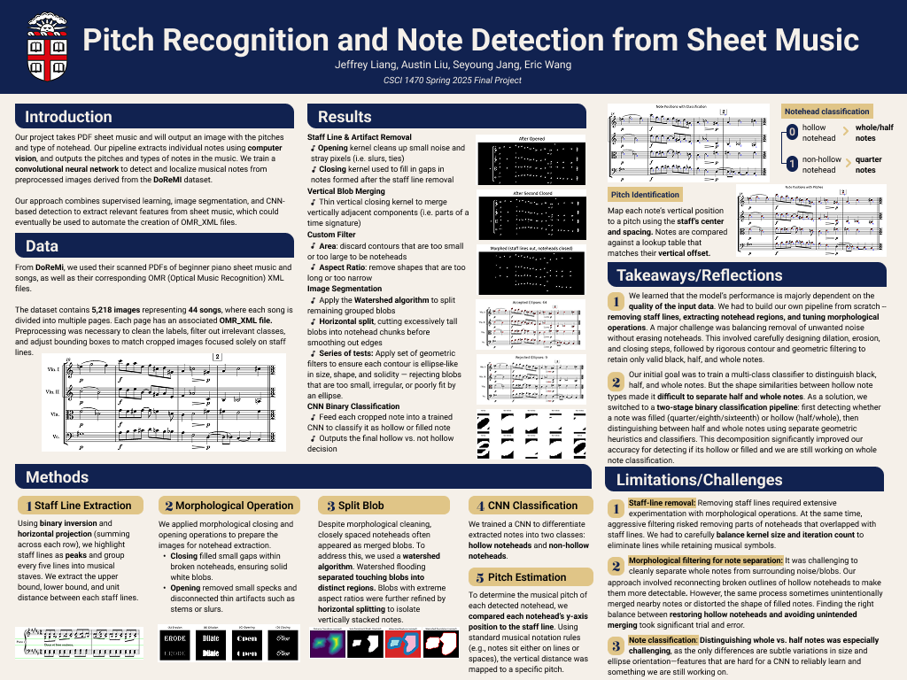

# Overview

We primarily worked in Kaggle, using two notebooks to manage all of our code. 

[Working Notebook](https://www.kaggle.com/code/apoxieforest/brown-s25-final-project-draftgit)

[Final Notebook](https://www.kaggle.com/code/apoxieforest/brown-s25-final-notebook)

We never got GitHub properly linked so each group member made Kaggle "commits" instead.

## Dataset

[DoReMi](https://github.com/steinbergmedia/DoReMi)

## Reference Project

[oemer](https://github.com/BreezeWhite/oemer)

## Poster

